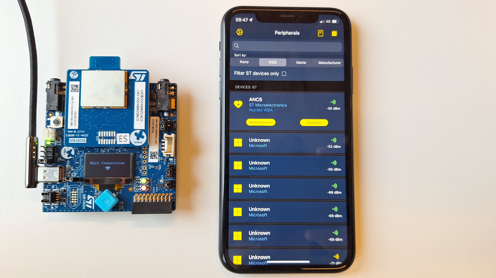
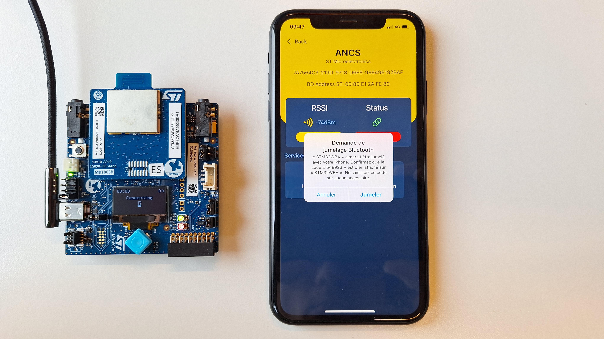
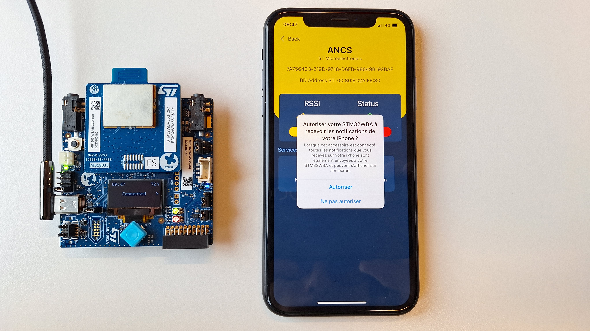
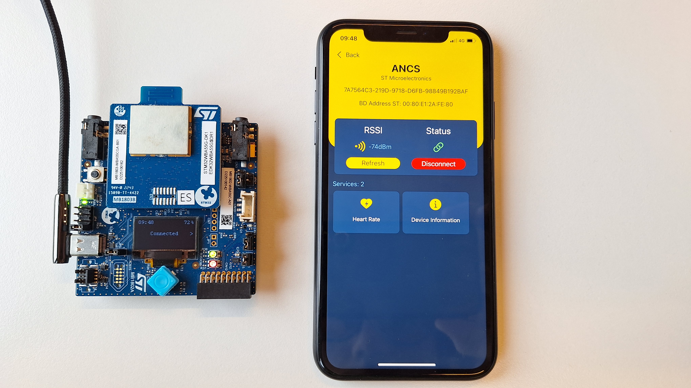
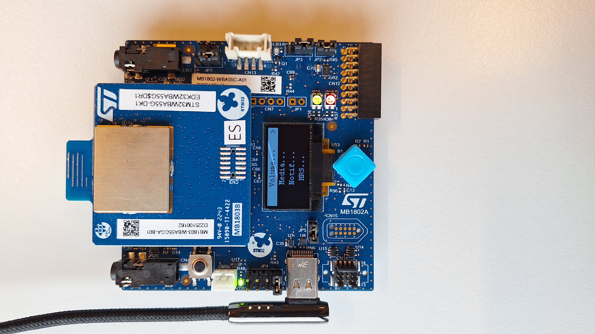
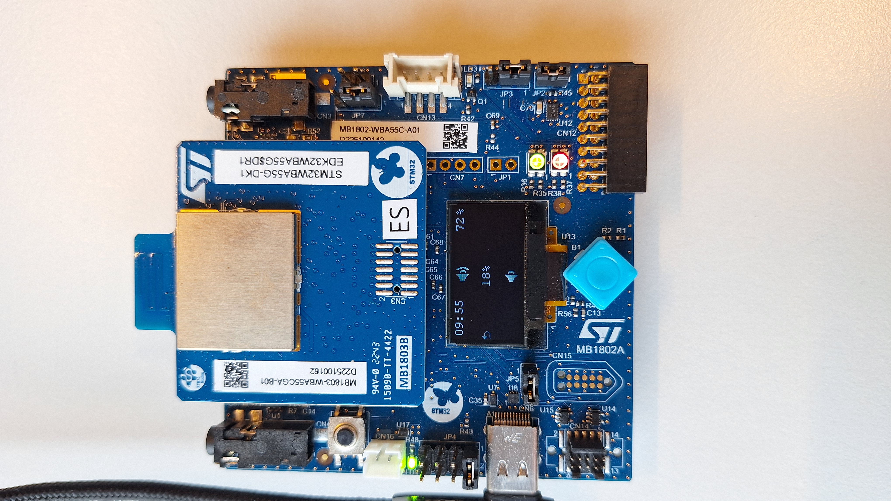
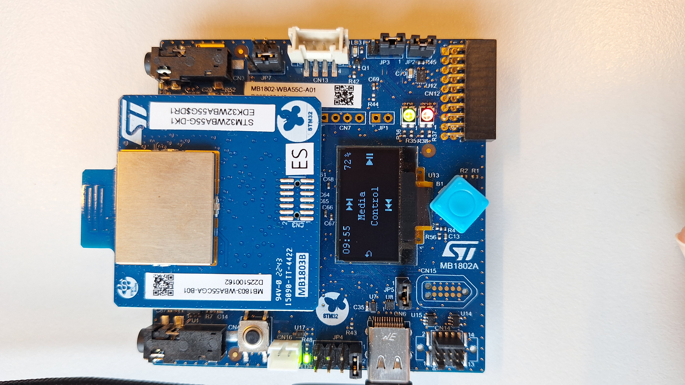
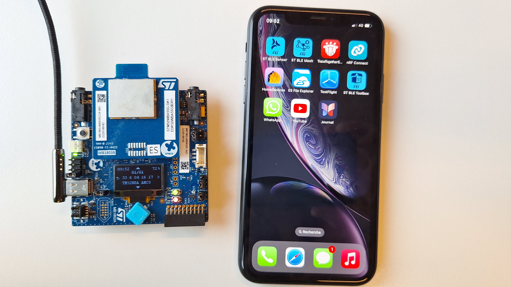
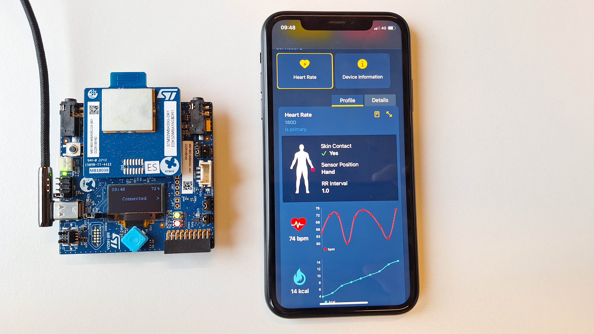
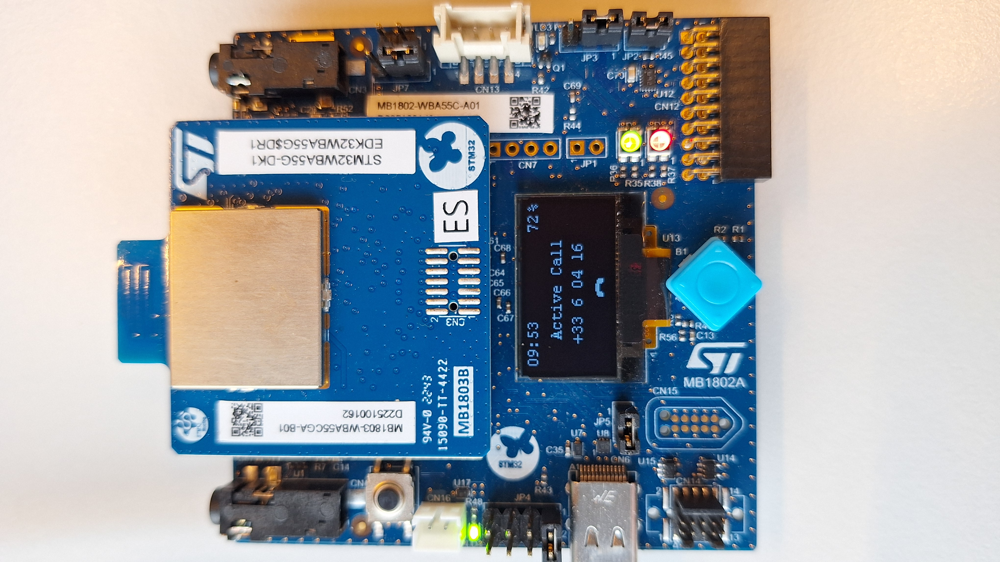

## STM32WBA-BLE-ANCS-AMS Application Description__

How to use the Apple Notification Center and Media Services (ANCS & AMS) as specified by Apple.

## Application Description

This ***STM32WBA-BLE-ANCS-AMS*** application uses the DK board to provide an easy interface to receive and display the current media and notification data on an **iOS device**.  

For more information regarding the ANCS and AMS functionning, please visit: <a href="https://developer.apple.com/library/archive/documentation/CoreBluetooth/Reference/AppleNotificationCenterServiceSpecification/Specification/Specification.html"> ANCS </a>
 and <a href="https://developer.apple.com/library/archive/documentation/CoreBluetooth/Reference/AppleMediaService_Reference/Specification/Specification.html"> AMS </a> documentation.

### __Keywords__

Connectivity, BLE, BLE protocol, BLE pairing, GATT Client

### __Hardware and Software environment__

  - This example runs on DK-STM32WBA55xx Discovery kit.
  - Connect the Discovery Kit Board to your PC with a USB cable type A to type C to ST-LINK connector (USB_STLINK). 

### __How to use it?__

In order to make the program work, you must do the following:
 - Open IAR toolchain
 - Rebuild all files and flash the board with the executable file

 On the iOS device, enable the Bluetooth communications, and if not done before:

   - Install the ST BLE Toolbox application on the iOS device:
     - <a href="https://apps.apple.com/us/app/st-ble-toolbox/id1531295550"> ST BLE Toolbox iOS</a>

 Power on the Discovery Kit board with the STM32WBA-BLE-ANCS-AMS application.

- Then, click on the App icon, ST BLE Toolbox (iOS device). You can use the "filter the ST devices only" option to retrieve more easily the advertiser named : "ANCS".

- When connected with the client, pairing request is sent, a popup asks you to associate your device. Once done, another popup asks the notification allowance, if not, make sure the ST BLE Toolbox and the iOS Device are up to date. if it's still not working, leave the app without closing it, the popup should appear.
  Pairing request pop up            |  Notification allowance request pop up
  :-------------------------:|:-------------------------:
   | 

- On the board, you should be able to see "connected" as well as the current time on the phone and the battery.

- With the right joystick, you can access the selection menu where you can :
   - change the phone's volume with up/down joystick.
   - display song/singer, pause/play/change current media with right/up/down joystick.
   - display your notification, and go to the next/previous one with up/down joystick. You can also do an action on the current displayed notification by pressing right joystick. The possible action will be displayed on the screen. (Most of the time the down action will be to delete the notification).
   - display the HeartRate and energy measurement.
  

  Volume menu | Media menu | Notification menu | Heartrate menu
  :----------:|:----------:|:-----------------:|:-------------:
   |  |  | 
To go on the last element shown, use the left joystick..

Incoming call notification    |  Call accepted
:------------------------------:|:-------------------:
 | 
## Troubleshooting

**Caution** : Issues and the pull-requests are **not supported** to submit problems or suggestions related to the software delivered in this repository. The STM32WBA BLE_ANCS_AMS_HeartRate example is being delivered as-is, and not necessarily supported by ST.

**For any other question** related to the product, the hardware performance or characteristics, the tools, the environment, you can submit it to the **ST Community** on the STM32 MCUs related [page](https://community.st.com/s/topic/0TO0X000000BSqSWAW/stm32-mcus).